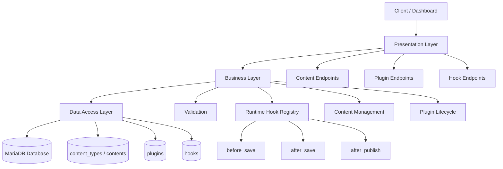
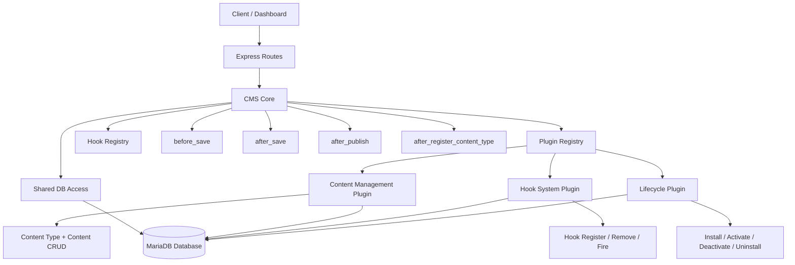

# Lab3 - So sanh `Layer Architecture` va `Microkernel Architecture` cho he thong CMS

## Tong quan

Day la bai lab mo phong cung mot he thong CMS duoc trien khai theo 2 kien truc khac nhau:

- `cms-layer`: to chuc he thong theo cac tang xu ly.
- `cms-microkernel`: to chuc he thong quanh `core` va cac `plugin`.

Hai project giu nguyen cung logic nghiep vu, chi khac nhau o cach to chuc kien truc.

## Muc tieu bai lam

- Minh hoa su khac nhau giua `Layer Architecture` va `Microkernel Architecture`.
- Giữ nguyen nghiep vu CMS de de so sanh.
- Co tai lieu va so do Mermaid de preview truc tiep tren GitHub.

## Nghiệp vụ được giữ nguyên ở cả 2 bản

- Quan ly `content type`
- CRUD `content`
- Quan ly vong doi `plugin`
- Quan ly `hook`

## Cau truc thu muc

```text
Lab3/
|-- cms-layer/
|   |-- src/
|   |   |-- config/
|   |   |-- layers/
|   |   |   |-- presentation/
|   |   |   |-- business/
|   |   |   `-- dataAccess/
|   |   `-- index.js
|   `-- package.json
|-- cms-microkernel/
|   |-- src/
|   |   |-- config/
|   |   |-- core/
|   |   |-- plugins/
|   |   |   |-- content-management/
|   |   |   |-- hook-system/
|   |   |   `-- lifecycle/
|   |   |-- routes.js
|   |   `-- index.js
|   `-- package.json
|-- mermaid/
|   |-- cms-layer-architecture.mmd
|   `-- cms-microkernel-architecture.mmd
`-- cms-dashboard.html
```

## So sanh nhanh 2 kien truc

| Tieu chi | `cms-layer` | `cms-microkernel` |
|---|---|---|
| Cau truc | Theo tang | Theo `core` + `plugin` |
| Luong xu ly | Request di qua tung tang | Route goi vao plugin thong qua core |
| Mo rong tinh nang | Them code vao tang phu hop | Them plugin moi |
| Muc do tach biet | Tang tren goi tang duoi | Plugin khong goi truc tiep nhau |
| Hop voi truong hop | He thong on dinh, luong xu ly ro rang | He thong can mo rong linh hoat |

## Kien truc 1: Layer Architecture

Trong `cms-layer`, request di tu tren xuong duoi theo thu tu:

1. `Presentation Layer`: nhan HTTP request va tra response.
2. `Business Layer`: xu ly nghiep vu, validate du lieu, goi hook.
3. `Data Access Layer`: thao tac truy van.
4. `MariaDB`: luu tru du lieu.

Luong chinh:

`Client -> Presentation -> Business -> Data Access -> MariaDB`

### So do Mermaid - Layer



## Kien truc 2: Microkernel Architecture

Trong `cms-microkernel`, he thong xoay quanh `CMS Core`:

1. `Routes` nhan request.
2. `Core` quan ly `plugin registry` va `hook registry`.
3. Moi plugin phu trach mot nhom chuc nang rieng.
4. Plugin ket noi thong qua core thay vi goi truc tiep nhau.

Luong chinh:

`Client -> Routes -> Core -> Plugin -> MariaDB`

### So do Mermaid - Microkernel



## Cach chay project

### 1. Chuan bi MariaDB

Tao 2 database:

```sql
CREATE DATABASE cms_layer;
CREATE DATABASE cms_microkernel;
```

Port database mac dinh la `3306`.

Neu MariaDB cua ban dung cong khac, sua `DB_PORT` trong file `.env` cua tung project.

### 2. Chay `cms-layer`

```powershell
cd .\cms-layer
copy .env.example .env
npm install
npm start
```

Truy cap:

- `http://localhost:3000`

### 3. Chay `cms-microkernel`

```powershell
cd .\cms-microkernel
copy .env.example .env
npm install
npm start
```

Truy cap:

- `http://localhost:4000`

### 4. Dashboard demo

Mo file `cms-dashboard.html` bang trinh duyet de demo giao dien va chuyen qua lai giua 2 kien truc.

## Cau hinh tranh conflict

De tranh xung dot khi ton tai dong thoi 2 project:

- Package name da duoc tach rieng: `lab3-cms-layer`, `lab3-cms-microkernel`
- App port tach rieng: `3000`, `4000`
- Database tach rieng: `cms_layer`, `cms_microkernel`

Ten folder `Lab3` khong anh huong toi runtime.

## API chinh

Ca hai project deu ho tro:

- `GET /api/content-types`
- `POST /api/content-types`
- `GET /api/contents`
- `GET /api/contents/:id`
- `POST /api/contents`
- `PUT /api/contents/:id`
- `DELETE /api/contents/:id`
- `GET /api/plugins`
- `POST /api/plugins/install`
- `POST /api/plugins/:name/activate`
- `POST /api/plugins/:name/deactivate`
- `DELETE /api/plugins/:name`
- `GET /api/hooks`
- `POST /api/hooks/register`
- `DELETE /api/hooks`

Rieng `cms-microkernel` co them:

- `POST /api/hooks/fire`

## Mermaid source files

Ngoai phan preview truc tiep trong README, source Mermaid van duoc luu rieng tai:

- `mermaid/cms-layer-architecture.mmd`
- `mermaid/cms-microkernel-architecture.mmd`

Neu can render thanh file anh:

```powershell
npm install -g @mermaid-js/mermaid-cli
mmdc -i ".\mermaid\cms-layer-architecture.mmd" -o ".\mermaid\cms-layer-architecture.svg"
mmdc -i ".\mermaid\cms-microkernel-architecture.mmd" -o ".\mermaid\cms-microkernel-architecture.svg"
```
